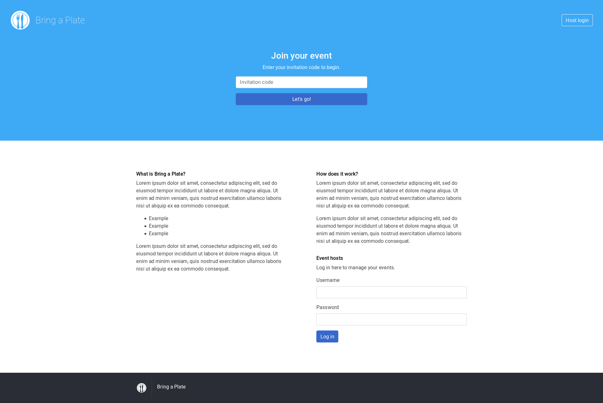
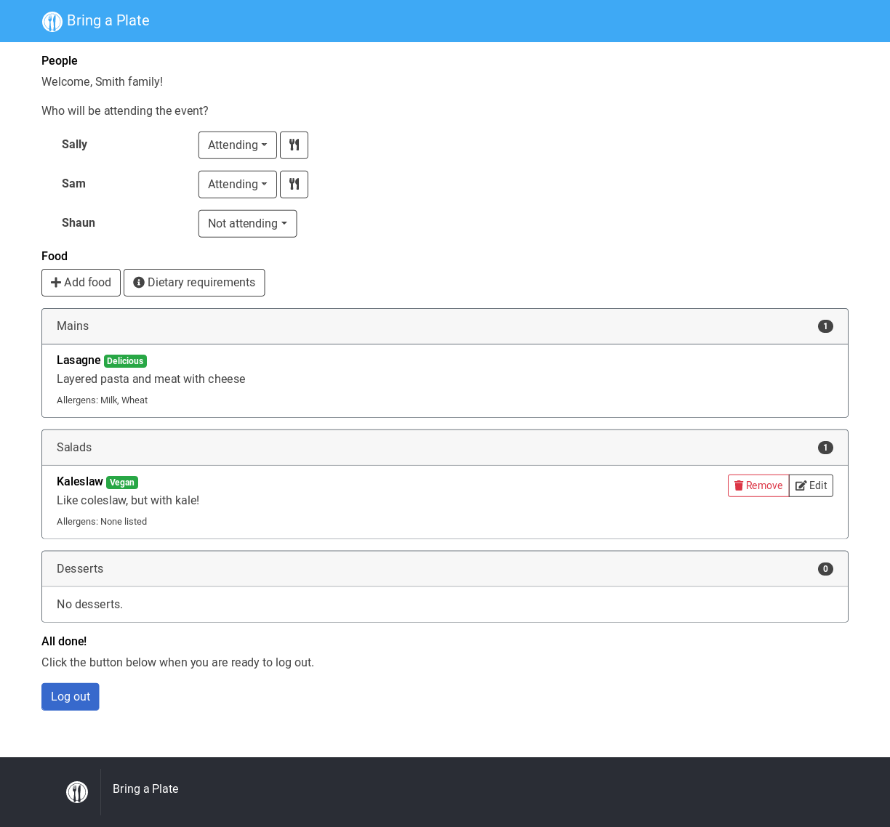
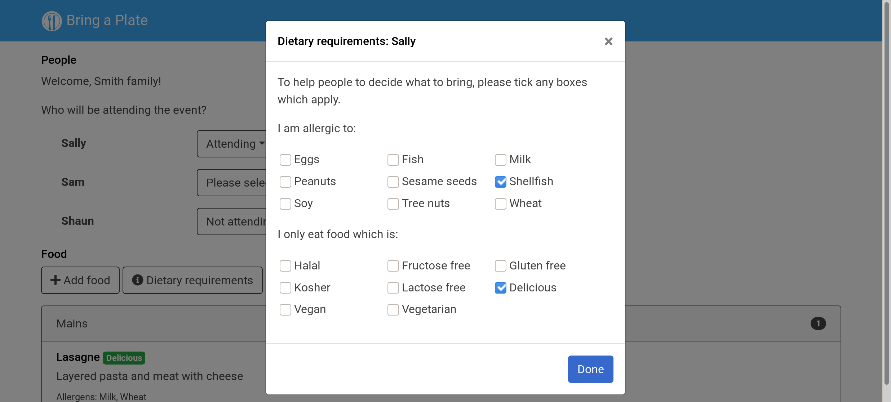
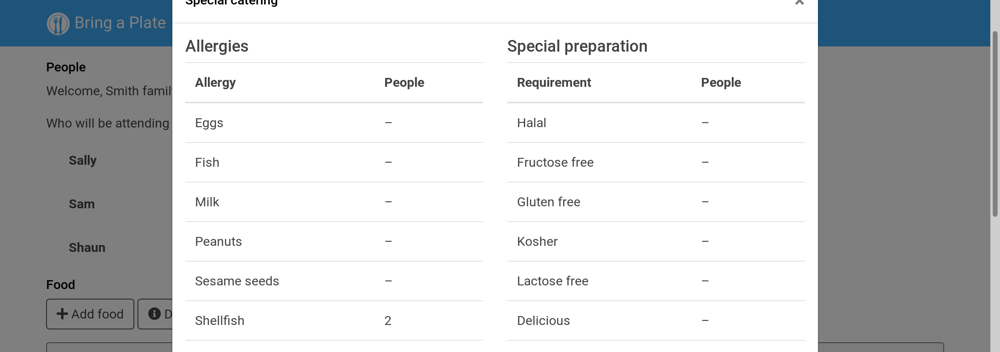
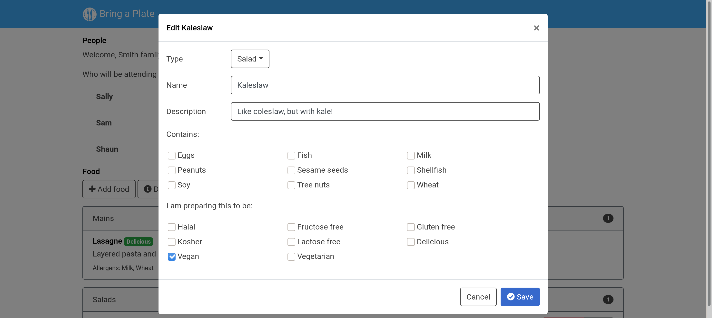
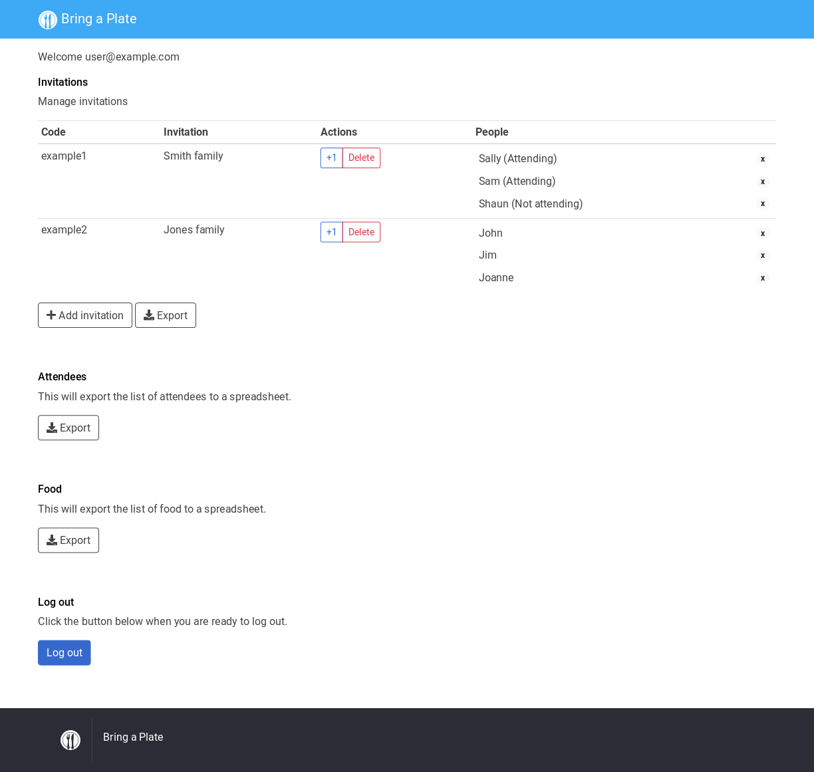
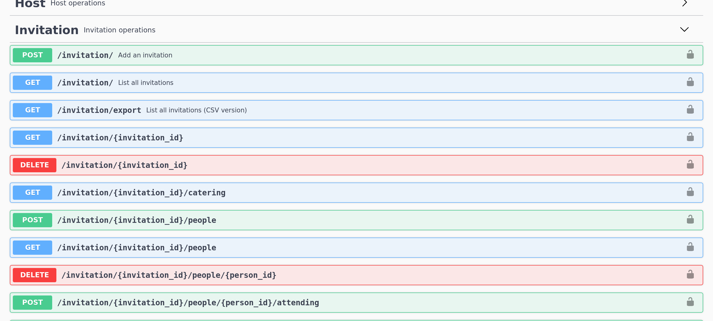

[!bring-a-plate](doc/embed/banner.png)](https://github.com/mike42/bring-a-plate)
===========================================================================

[](https://travis-ci.org/mike42/bring-a-plate)

**Bring a Plate* is a web app to co-ordinate attendee-catered events.



### How it works 

The host of the event distributes login codes to each guest.



When a guest logs in, they can specify dietary requirements for each person on their invitation, and can also view the food which other guests are bringing.



Anonymous information about the prevalance of different dietary requirements at the event is visible to all guests.



Guests then have good information to choose what to bring, and are also prompted to label their dishes according to any allergens and special preparation that's gone into it.



Event hosts have a rudimentary interface to manage their guest list.



This page also allows them to export information to spreadsheets, so that that they can perform other event-management tasks, sugh as:

- Creating invitations with a mail merge
- Producing food labels which list allergens and special preparation for food (eg. vegetarian or halal)
- Preparing name tags

## Tech

The front-end is React/Bootstrap, while the back-end is a Flask (Python) app.

Data interchange is performed over REST. The app ships with an OpenAPI spec for power users, which can be exercised through Swagger.



## Build process

### Front-end

The front-end is a Javascript (React) single-page application. Build it as follows:

```bash
(cd frontend && \
    npm install &&
    npm run-script build)
```

### Back-end

The back-end is a Python (Flask) WSGI application. It does not need to be built, but dependencies will need to be loaded into a virtual env.

```bash
(cd backend && \
    python3 -m venv venv && \
    ./venv/bin/pip install -r requirements.txt)
```

## Deployment

### Local Docker

To build a container image of `bring-a-plate` and start it locally:

```bash
docker build -t bring-a-plate:0.0.1 .
docker run -p 8080:80 bring-a-plate:0.0.1
```

The app will then be accessible at `http://localhost:8080`.

### Kubernetes cluster

This repository also bundles a Kubnernetes deployment YML definition. Use the following command to build and deploy a `bring-a-plate` container image on a local Minikube cluster:

```bash
eval $(minikube docker-env)
docker build -t bring-a-plate:0.0.1 .
kubectl apply -f deploy/deployment.yml
```

You can then access the app on port 8080 on the relevant cluster IP (you may need `minikube tunnel` to make this IP visible from the local machine).

```
$ kubectl get service
NAME                    TYPE        CLUSTER-IP      EXTERNAL-IP   PORT(S)    AGE
bring-a-plate-service   ClusterIP   10.96.189.123   <none>        8080/TCP   6m54s
```

### Manual installation

The following steps assume that you are running a recent Debian GNU/Linux or Ubuntu system. The app needs to run in a web server which does the following:

- Serve the front-end as static resources
- Run the back-end via a WSGI container

Install dependencies:

```bash
sudo apt-get install apache2 libapache2-mod-wsgi-py3
```

Copy in the front-end:

```bash
sudo cp -Rv frontend/build/* /var/www/html/
```

Place the back-end somewhere outside the webroot:

```bash
sudo mkdir -p /var/www/bring-a-plate
sudo cp -Rv backend/* /var/www/bring-a-plate
```

Add these lines to `/etc/apache2/sites-enabled/000-default.conf`, just before `</VirtualHost>`

```bash
WSGIDaemonProcess bring-a-plate home=/var/www/bring-a-plate python-home=/var/www/bring-a-plate/venv
WSGIProcessGroup bring-a-plate
WSGIApplicationGroup %{GLOBAL}
WSGIScriptAlias /api /var/www/bring-a-plate/application.py/api
<Directory /var/www/bring-a-plate/>
    Require all granted
</Directory>
```

Restart apache.

```bash
systemctl restart apache2
```

