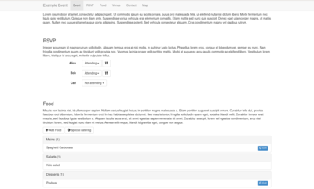
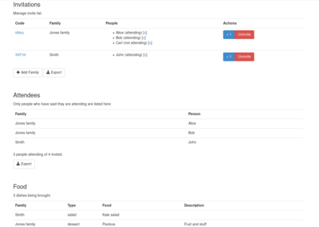

# Bring a Plate

This is a web app to help you co-ordinate "bring a plate" events, by giving each guest a unique web link. They can use the app to view what food is being brought, and what dietary requirements other guests have (although they can't see the guest list!).



For the organiser, there is a special interface for creating the invitation links. It allows the food, invitation and guest lists to be exported as a spreadsheet.



The spreadsheet export is helpful for your other event management tasks:

- Create invitations with a mail merge
- Generate QR codes for web links
- Produce food labels which list allergens and specially mark vegetarian food
- Prepare name tags

## Set up

The following setup steps will get the app running on a recent version of Debian.

Install dependencies

```
sudo apt-get install apache2 php mariadb-server php-mysql
```

Create a database user account. Replace '...' with a strong password.

```
$ sudo mariadb
> CREATE DATABASE `bring-a-plate`;
> CREATE USER 'bring-a-plate' IDENTIFIED BY '...';
> GRANT USAGE ON *.* TO 'bring-a-plate'@'%' IDENTIFIED BY '...';
> GRANT ALL privileges ON `bring-a-plate`.* TO 'bring-a-plate'@'%' IDENTIFIED BY '...';
```

Import the database schema:

```
mysql --user=bring-a-plate bring-a-plate --password < lib/database/bring-a-plate.sql
```

- Place the contents of this repo available over HTTP:

```
git clone git@github.com:mike42/bring-a-plate.git
cd bring-a-plate
sudo ln -s $(pwd) /var/www/html/bring-a-plate
```

- Copy "site.example" to "site" and edit config.php to add an account which can access this database.
- Log in to your site (load 'admin.php') to verify that it's working.
- Secure your admin.php (see below)
- Write up your event information in `content.php`.

## How to secure admin.php

The admin.php file lets you view and edit the invitations. If you don't secure it, then anybody can change the guest list!

With Apache, you need to set up [Authentication](http://httpd.apache.org/docs/current/howto/auth.html) for it. On most shared web hosts, you can log in and put something like this in the admin/ folder:

    AuthUserFile /home/username/.htpasswd
    AuthName "Login Required"
    AuthType Basic

    require valid-user

And then the htpasswd program would be used to generate the logins.

## External libraries

- [jQuery](http://jquery.com/)
- [Twitter Bootstrap](http://getbootstrap.com/)
